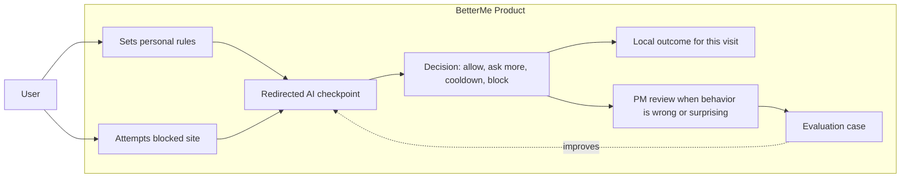

# BetterMe

BetterMe is a Chrome extension for people who want friction before opening distracting websites. When a user tries to visit a blocked site, BetterMe redirects them to an AI checkpoint and asks them to explain their purpose, time boundary, and exit plan before access is allowed.

## Product Demo

### The Core Moment: Redirected Checkpoint

The main product experience is the redirected page. BetterMe interrupts the habit loop at the exact moment the user tries to open a distracting site, then asks them to make the visit intentional.


### Personal Boundaries

Users choose the domains or exact URLs they want BetterMe to guard, set checkpoint strictness, and connect their own OpenAI-compatible provider key.


### PM Review Loop

The PM Review workspace makes AI behavior inspectable: reviewers can see what the model received, what it returned, and how that decision should be evaluated in future cases.


## Product Story

Most website blockers are binary: a site is either blocked or unblocked. BetterMe treats self-control as a decision moment:

1. The user attempts to open a distracting site.
2. BetterMe redirects them to a checkpoint instead of the site.
3. The user explains why they need access now.
4. The AI checkpoint classifies the request as clear, vague, repeated, or risky.
5. BetterMe turns that decision into a product outcome: allow, ask one more question, start a cooldown, or block.
6. Bad or surprising decisions can be reviewed and turned into evaluation cases.

The product goal is to make impulsive browsing slower, more explicit, and easier to learn from.

## Product System



This is the architecture from a user's point of view: setup creates the boundary, the redirected checkpoint handles the moment of temptation, local outcomes enforce the decision, and PM review keeps the AI behavior from staying a black box.

## What a PM Interviewer Should Notice

- **Clear user problem**: the product targets a specific high-friction moment, not a broad productivity dashboard.
- **Concrete behavior loop**: blocked attempt -> checkpoint -> structured decision -> local outcome.
- **AI as product logic**: the model does not just chat; it drives visible product states.
- **Failure handling**: bad AI decisions can become review cases and regression cases.
- **Scope discipline**: the MVP focuses on a Chrome extension, BYOK provider setup, local enforcement, and PM review before adding social or cloud features.

## What I Built

- A Chrome MV3 extension with settings, popup, redirected block page, onboarding, and PM Review surfaces.
- A checkpoint flow that turns a blocked-site attempt into a structured AI decision.
- Local state for blocked targets, temporary access, cooldowns, review cases, evaluation cases, and encrypted provider settings.
- A PM Review workspace that connects product review with AI evaluation cases.
- Validation scripts for type checking, extension builds, AI Check behavior, and browser flows.

## Repository Map

```text
apps/extension/
  src/pages/              Extension pages and PM Review UI
  src/blocking/           Access rules, cooldowns, unlocks, and holds
  src/ai/                 AI Check conversation, provider call, parsing, review store
  src/background/         Chrome extension service worker and routing
  src/shared/             Shared contracts, provider metadata, and constants
  src/storage/            Local persistence and encrypted provider-key storage
  evals/ai-check-cases/   Saved AI Check evaluation cases

docs/design/              Product design, progress, and issue notes
docs/assets/readme/       README screenshots
```

## Run Locally

```bash
npm install
npm run build
```

Load the built extension in Chrome:

1. Open `chrome://extensions`.
2. Enable Developer mode.
3. Click Load unpacked.
4. Select `apps/extension/dist`.

For local development:

```bash
npm run dev
```

## Validation

```bash
npm run typecheck
npm run build
npm --workspace apps/extension run test:ai-check
npm --workspace apps/extension run eval:ai-check
npm --workspace apps/extension run test:e2e
```

## Design Notes

The project keeps implementation-linked design notes under `docs/design/`.

| Topic | Design | Progress | Issues |
| --- | --- | --- | --- |
| Access state and local enforcement | [design](docs/design/2026-05-12-access-state-design.md) | [progress](docs/design/2026-05-12-access-state-progress.md) | [issues](docs/design/2026-05-12-access-state-issues.md) |
| AI Check session state machine | [design](docs/design/2026-05-12-ai-check-session-state-machine-design.md) | [progress](docs/design/2026-05-12-ai-check-session-state-machine-progress.md) | [issues](docs/design/2026-05-12-ai-check-session-state-machine-issues.md) |
| PM Review workspace | [design](docs/design/2026-05-20-pm-review-workspace-design.md) | [progress](docs/design/2026-05-20-pm-review-workspace-progress.md) | [issues](docs/design/2026-05-20-pm-review-workspace-issues.md) |
| Provider message contract | [design](docs/design/2026-05-21-ai-check-provider-message-contract-design.md) | [progress](docs/design/2026-05-21-ai-check-provider-message-contract-progress.md) | [issues](docs/design/2026-05-21-ai-check-provider-message-contract-issues.md) |

## Current Scope

BetterMe is an MVP and portfolio project. The current scope focuses on the local browser experience, AI checkpoint decisioning, PM review, and evaluation loop. It does not yet include a mobile app, accountability partner workflows, community features, or a cloud sync product.
